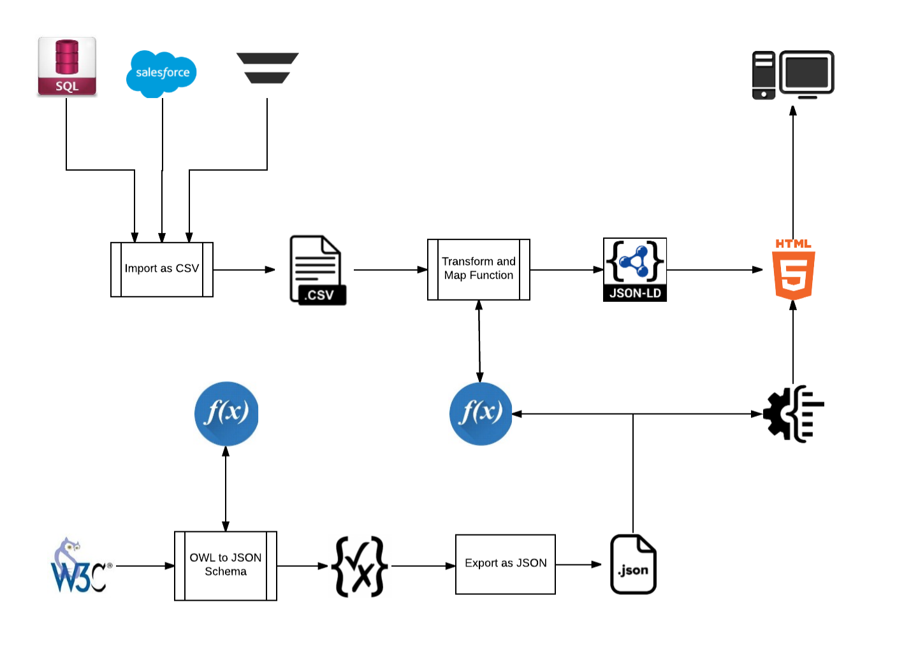

# semanticdatamaster (SDM)
Master data definition using Linked Data Semantic ontologies to drive [JSON Schema](http://json-schema.org/) and Schema Forms
Semantic Data Master (SDM) is a javascript process that enabled form building via JSON Schema definitions and Web Ontology Language (OWL) as the schema specified for the form fields.
The intention is to empower the use of [Using JSON Schema to describe your data model](https://github.com/joshfire/jsonform/wiki#schema) via [jsonform](https://github.com/joshfire/jsonform) and to produce the JSON schema from OWL specifications using a version of [owl2jsonschema.js](https://github.com/redaktor/owl2jsonschema.js)
This would be in alignment, more or less, with the purpose of [XMLSchema]() and eventually the constraint language SHACL to define schema and interdepencies and restrictions. 

For proof of concept purposes this project will include elements:

* SQL Table Contacts Scheme
* Salesforce.com Contacts Scheme
* Autopilot HQ Contact Scheme
* CSV Export from SQL, SFDC, Autopilot
* Upload and map to Semantic Scheme (mapping interface library?)
* CSV to JSON to JSON-LD Transform functions
* ‘Cell’ Property functions cia CALC.zip, FUNCTIONS.zip, other
* Field Definitions ala Applaud
* View / Manage HTML Form(s) via JSON Schema Forms
* JSON Schema generator from OWL Ontology / Vocabulary
* Master Contact Vocabulary OWL definitions / restrictions with sameAs / similarTo across ontologies
* Master Data Dictionary for Contact with sf, vcard, schema, foaf, org, perse
* Content Object Superclass w/ key, has, id, kind, type, etc
* WebApp ala Fundamentally Simple...

[A JSON Media Type for Describing the Structure and Meaning of JSON Documents | JSON Schema attributes](https://tools.ietf.org/html/draft-zyp-json-schema-03#section-5)

[JSON Schema (core)](https://datatracker.ietf.org/doc/draft-handrews-json-schema/)

[JSON Schema Validation: A Vocabulary for Structural Validation of JSON](https://datatracker.ietf.org/doc/draft-handrews-json-schema-validation/)

[OWL - Semantic Web Standards](https://www.w3.org/OWL/)

[OWL Web Ontology Language Current Status - W3C](https://www.w3.org/standards/techs/owl#w3c_all)
